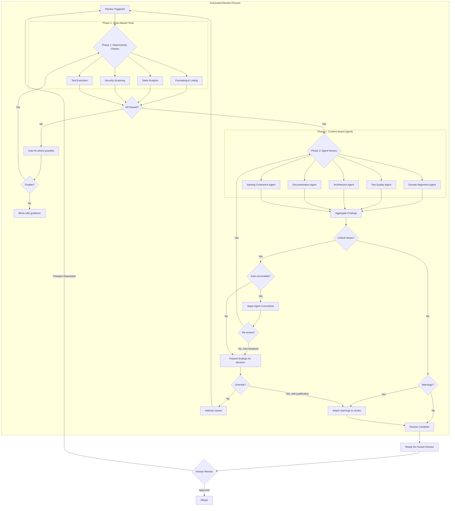

# Automated Code Review with AI Agents Reference Architecture

<small>v1.0</small>

A hybrid approach combining deterministic rules-based tooling with context-aware AI agents to automate everything that
can be automated about code review.

> It should be noted that this solution is for teams and organizations that are already have
> a [solid continuous delivery process](https://bryanfinster.substack.com/p/ai-is-a-high-pass-filter-for-software).
> For teams still on that journey, do not start here! Start with a vision of here.
> Please read my article on how to [get there faster with the assistance of agents](https://bryanfinster.substack.com/p/incorporating-ai-without-crashing).

## The Problem with Traditional Code Review

Rules-based tools should already handle mechanical concerns. Formatting, linting, static analysis, security scanning;these have deterministic right answers and shouldn't consume human attention. If your team is still catching formatting issues in review, fix your tooling.

Similarly, business logic correctness should be validated by tests, not by reading code. If a reviewer has to trace through implementation to determine whether it handles edge cases correctly, that's a missing test, not a review task.

This becomes automatable when business rules are documented as test scenarios before coding begins. Agents can then verify that tests exist for each documented scenario and that the tests actually assert the expected outcomes. Review shifts from implementation to requirements. Errors that slip through are requirement errors;scenarios that were never documented;not implementation bugs that a test review would have caught.

Even with proper tooling and test coverage, significant review time remains. Reviewers still evaluate naming coherence, domain alignment, architectural fit, documentation accuracy, and test quality;things that require understanding context and intent, not just pattern matching.

This was manageable when code generation was the bottleneck. A developer might produce a few hundred lines of reviewable code per day. Review capacity roughly matched generation capacity.

AI-assisted code generation has broken this balance. Developers using AI tools can generate code faster than teams can
review it. Pull requests queue up. Reviewers batch work to stay efficient, which increases cycle time. The feedback loop
that makes code review valuable, the fast iteration on design and approach, degrades.

The result is a choice between thoroughness and speed. Teams either maintain review quality and accept slower delivery, or they reduce review depth to keep up. Neither option is good.

The solution is to automate everything about code review that can be automated, reserving human attention for decisions
that genuinely require human judgment.

## Goal: Automate Everything Automatable

The goal is to reduce human review to only those decisions that genuinely require human judgment; design tradeoffs,
architectural direction, business logic validation. However, if you are doing any of these in code review, you need to
stop here and fix reasons these are not resolved before coding. Everything else should be caught and, where possible,
corrected automatically.

This process can run at any point: on commit, on push, on pull request creation, on demand, or continuously in the
background. The trigger doesn't matter. What matters is that by the time a human reviewer sees the code, the automatable
concerns have already been handled. Be aware that I am accountable to my AI spend rate and act accordingly when I do
this and will run this when I integrate to the trunk.

## A Two-Phase Review Architecture

This process separates concerns into what machines do well deterministically (Phase 1) and what requires contextual reasoning (Phase 2), with a feedback loop that allows automated correction before human review.



## Phase 1: Deterministic Checks

These run first because they're fast, cheap, and have no false positives when configured correctly. No point wasting agent compute on code that won't compile.

- Formatting and Linting
- Static Analysis
- Security Scanning
- CI Test Suite Execution

## Phase 2: Context-Aware Agent Review

Once code passes mechanical checks, agents evaluate aspects that require understanding intent and context. Each agent operates as a specialist with a focused mandate.

### Domain Alignment Agent

Reviews code against the domain model and ubiquitous language.

**Example:**

- Do new names align with established domain terminology?
- Are abstractions at the right level for this bounded context?
- Does this change respect aggregate boundaries?
- Would a domain expert recognize these concepts?

### Test Quality Agent

Evaluates whether tests specify behavior or merely execute code.

**Example:**

- Do test names describe behavior from a user/caller perspective?
- Are tests coupled to implementation details that will cause brittle failures?
- Do assertions verify outcomes or just absence of exceptions?
- Are edge cases from requirements covered?
- Would these tests catch a regression, or just confirm the code runs?

### Architecture Agent

Evaluates whether changes align with intended system structure.

**Example:**

- Does this change introduce dependencies that violate layer boundaries?
- Is this the right module for this responsibility?
- Does this move toward or away from documented architectural intent?
- Are new patterns consistent with established patterns for similar problems?

### Documentation Agent

Checks alignment between code and its documentation.

**Example:**

- Do README files still accurately describe the module after this change?
- Are inline comments now stale or misleading?
- Does API documentation reflect current behavior?
- Should this change trigger an ADR update or new ADR?

### Naming Coherence Agent

Ensures terminology consistency across the codebase.

**Example:**

- Are similar concepts named consistently?
- Do abbreviations match established patterns?
- Are boolean names predictable?
- Do method names follow codebase conventions?

## The Self-Correction Loop

Agent findings fall into three categories:

### Auto-Correctable with High Confidence

The agent can fix the issue and is confident the fix is correct. Examples: renaming to match conventions, updating stale comments with clear replacements, fixing terminology inconsistencies.

These corrections are applied automatically and the agent phase re-runs to verify the fix didn't introduce new issues. A maximum iteration limit (typically 2-3) prevents infinite loops.

### Auto-Correctable with Medium Confidence

The agent can propose a fix but isn't certain it's correct. These are presented as suggested diffs that can be accepted, modified, or rejected.

### Not Auto-Correctable

Issues requiring human judgment: architectural decisions, test design, complex refactoring. These block the automated review with clear guidance on what needs attention.

## Review Annotations

When warnings exist but don't block the review, they're attached as structured metadata. This creates a record of known rough edges, giving human reviewers context about what the automated process flagged and what was acknowledged.

## Override Mechanism

Non-critical agent findings can be overridden with justification. Overrides are logged and can be audited. Patterns of overrides for the same rule suggest the rule needs adjustment.

## Agent Configuration

Each agent requires configuration that establishes its review criteria and connects it to relevant context in your codebase.

### Prompting for Initial Configuration

When setting up an agent, provide it with:

1. **Role and scope** : What aspect of the code this agent owns and what it should ignore
2. **Reference material** : Pointers to documentation, conventions, or examples that define "correct" for your codebase
3. **Output expectations** : How findings should be categorized (severity, correctability) and what information to include
4. **Boundaries** : What the agent should flag versus what it should leave to human judgment

The agent should be able to learn your codebase's conventions from examples rather than exhaustive rules. Point it at good code and let it infer patterns.

### Example: Test Quality Agent

```
You are a test quality reviewer. Your job is to evaluate whether tests 
actually verify behavior or just execute code.

Reference the existing tests in /tests/unit/orders/ as examples of our 
preferred testing style. Note how test names describe outcomes, assertions 
check state changes, and mocks are minimal.

For each test file in the diff, evaluate:
- Does each test name describe a behavior outcome?
- Do assertions verify state changes, not just absence of errors?
- Are mocks used only for external boundaries, not internal collaborators?
- Would this test fail if the behavior regressed?

Categorize findings as:
- critical: Test provides false confidence (passes but doesn't verify behavior)
- warning: Test could be improved but does provide some verification
- suggestion: Stylistic improvement

For critical and warning findings, indicate whether you can propose a 
correction with high confidence, medium confidence, or if it requires 
human judgment.

Do not flag tests for external integrations or end-to-end tests; those 
follow different patterns and are outside your scope.
```

The prompt establishes scope (unit tests only), provides reference examples, defines the evaluation criteria, specifies output format, and sets boundaries. Adjust based on your codebase's testing philosophy.

## Trigger Points

The review process can be invoked at multiple points depending on workflow needs:

### On Demand

Developer explicitly requests review of staged changes or a branch. Useful during development for early feedback before creating a pull request.

### On Push

Review runs automatically when changes are pushed to a branch. Results are attached to the branch and visible before PR creation.

### On Pull Request

Review runs when a PR is created or updated. Findings are posted as PR comments, and auto-corrections can be committed directly to the branch.

### Continuous Background

Review runs periodically on the main branch or long-lived feature branches, catching drift in documentation, architecture, or naming that accumulates over time even without direct changes.

### CI Integration

CI pipeline triggers the full review process. CI results are authoritative; other trigger points provide early feedback but CI is the gate.

## Measuring Effectiveness

Track these metrics to tune the process:

- **Override rate by agent**: High override rates suggest miscalibrated rules
- **Post-merge issues by category**: Issues caught in production that agents should have flagged
- **Agent false positive rate**: Developer-reported findings that weren't actual issues
- **Self-correction success rate**: Percentage of auto-corrections that didn't require reversion

Treat these like production defects and update the agents to prevent that class of issue.

## Limitations and Honest Tradeoffs

This process adds latency. Phase 1 should complete in seconds; Phase 2 adds 10-60 seconds depending on configuration and
diff size. For rapid iteration, this might be run less frequently or with a subset of agents. However, consider this
compared to the manual alternative.

Agents hallucinate when information accuracy is low or the size of information exceeds the recommended threshhold. Good
practice is 50% the size of the context window. They will occasionally flag non-issues or suggest incorrect fixes when
this happens. The confidence scoring and human override
mechanisms exist because agent aren't responsible for the changes.

Context window limits mean agents see a slice of the codebase, not the whole thing. They may miss cross-cutting concerns
or historical context that isn't in their input window. A good practice is to have agents audit the code base and agent
configurations to suggest ways to make things better organized for their context windows.

This doesn't replace human review. It's aimed at focusing review only on things that cannot be revieed with
automation and that list is much shorter than it was.

## Getting Started

1. Implement Phase 1 with standard tooling. I seriously hope that's already done
2. Add one agent, tuned to your codebase's patterns
3. Measure and adjust before adding more agents
4. Expand agent coverage based on where review feedback clusters
